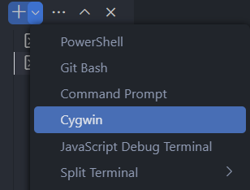

# Integrating `Cygwin` with `VSCode` in Windows

## Installation

Follow guide from [Cygwin](https://cygwin.com/).

## Add terminal profile in `settings.json`

Add new profile for `cygwin`, this will register a new option when we choose to launch a new integrated terminal.

```json{15-19}
{
    "terminal.integrated.profiles.windows": {
        "PowerShell": {
            "source": "PowerShell",
            "icon": "terminal-powershell"
        },
        "Command Prompt": {
            "path": ["${env:windir}\\Sysnative\\cmd.exe", "${env:windir}\\System32\\cmd.exe"],
            "args": [],
            "icon": "terminal-cmd"
        },
        "Git Bash": {
            "source": "Git Bash"
        },
        "Cygwin": {
            "path": "C:\\cygwin64\\bin\\bash.exe",
            "args": ["--login"],
            "overrideName": true
        }
    },
}
```

Then we got a new option to create a integrated terminal.



:::info
For more information: [Terminal Profiles](https://code.visualstudio.com/docs/terminal/profiles#_cygwin).
:::

## Change default working directory of cygwin in `.bashrc`

The default working directory of `cygwin` is `{installation-path}\home\{username}` like `C:\cygwin64\home\anon`.

You might like to launch cygwin with working directory as the root of current user.

- Open cygwin, make sure you're at `~`

```bash
cd ~
```

- Execute this line into `.bashrc`.

```bash
touch .bashrc && echo 'cd /cygdrive/c/users/{username}' >> .bashrc
```

- Check the content is successfully appended.

```bash
cat .bashrc
```

- Launch a new cygwin instance, it will start at your user root.

## Using System Proxy from Windows

Switch to `~` , append `http_proxy` and `https_proxy` to `.bashrc`.

```bash
cd ~ && echo "export http_proxy=<proxy:port>" >> .bashrc && echo "export https_proxy=<proxy:port>" >> .bashrc
```
