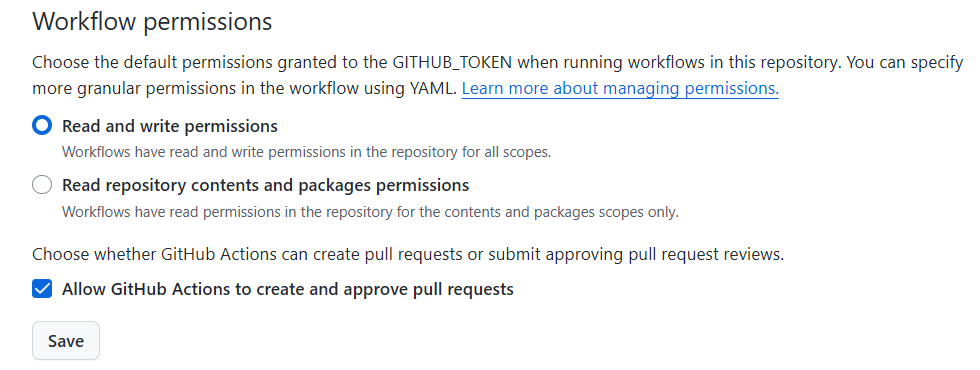
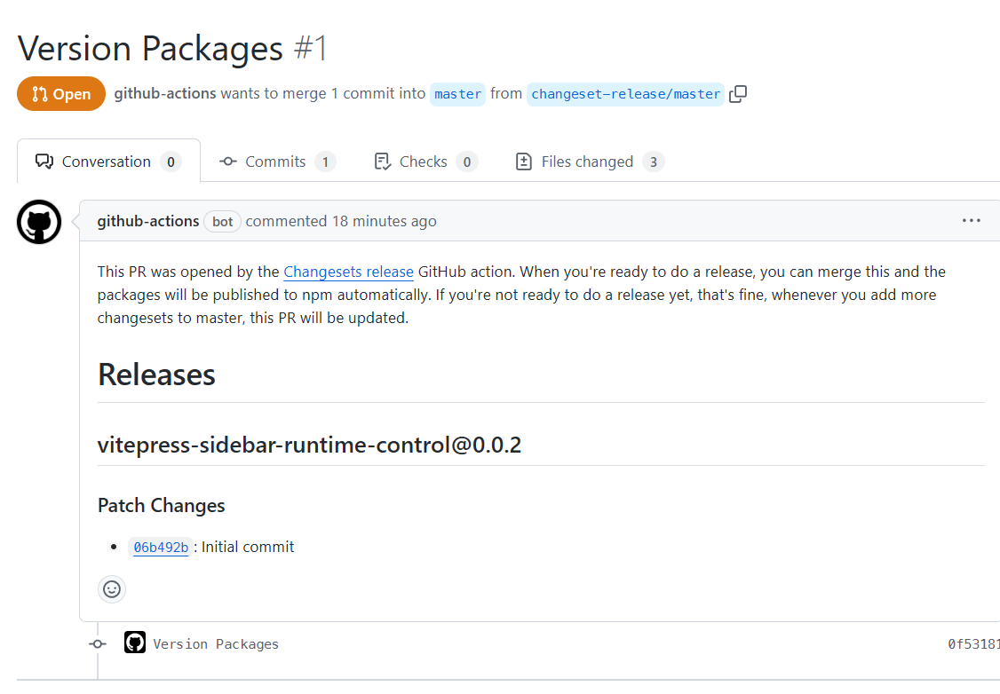

# Developing your first npm library - Build, CI and Publish

## Prerequisites

- Node.js

- Package manager: `npm` (or any alternative like `pnpm`)

- Github account

- npm account

## Project structure

Create three folders for library source(src), testing(test), and compiled(dist).

```text
project-root
|
+---dist
+---src
\---test
```

## Init repository

Init your repository and add `.gitignore`

```bash
git init
```

```txt
dist
node_modules
```

## Init `package.json`

```bash
npm init -y
```

Add package name for your project.

```json
// package.json
{
  "name": "My first npm package",
}
```

## Add LICENSE

Install `license` for generating a `LICENSE`.

```bash
npm install license -D
```

Add MIT license or add other license, the author name is the same as the user.name in current git config.

```bash
npx license MIT
# or
npx license
```

## Add TypeScript

### Add as devDependency

```bash
npm install -D typescript
```

### `tsconfig.json`

```bash
npx tsc -init
```

```json
// tsconfig.json
{
  "include": ["./src/**/*.ts"],
  "exclude": ["./node_modules"],
  "compilerOptions": {
    "target": "es2016",
    "rootDir": "./src",
    "outDir": "./dist",
    "esModuleInterop": true, 
    "forceConsistentCasingInFileNames": true,
    "strict": true,
    "skipLibCheck": true,
    "noEmit": true
  }
}
```

## Add [`tsup`](https://github.com/egoist/tsup)

`tsup` is a zero-config TypeScript bundler with a focus on simplicity and speed. It is designed to make it easy to bundle TypeScript code for the web without needing extensive configuration. The name "tsup" is derived from "TypeScript micro bundler."

```bash
npm install -D tsup
```

### Add scripts in `package.json`

Add a script that calls `tsup` to help us build the source.
And `lint` for get syntax checking.

```json{4,5}
// package.json
{
  "scripts": {
    "build": "tsup ./src/index.ts -d ./dist --format cjs,esm --dts",
    "lint": "tsc"
  }
}
```

### Build using `tsup`

Now add `./src/index.ts` just for demonstration.

```ts twoslash
export const hello = () => console.log('Hello!');
```

Then build it. And check compiled file in `./dist`

```bash
npm run build
```

## Add [`vitest`](https://github.com/vitest-dev/vitest?tab=readme-ov-file) for testing

Vitest testing framework powered by Vite. It aims to position itself as the Test Runner of choice for Vite projects, and as a solid alternative even for projects not using Vite.

```bash
npm install -D vitest
```

### Create a test

Add `./test/index.test.ts` for demonstration.

```ts
import { describe, expect, it } from "vitest";

describe("Whatever", () => {
    it("should pass CI", () => {
        expect(1).toBe(1);
    });
});
```

### Add scripts for testing

```json{6,7}
// package.json
{
    "scripts": {
        "build": "tsup ./src/index.ts -d ./dist --format cjs,esm --dts",
        "lint": "tsc",
        "dev": "vitest", // watch the project
        "test": "vitest run"
    },
}
```

## Add script for CI

When CI runs, we should do syntax check first, then testing, finally build our library.

```json{7}
// package.json
{
    "build": "tsup ./src/index.ts -d ./dist --format cjs,esm --dts",
    "lint": "tsc",
    "dev": "vitest",
    "test": "vitest run",
    "ci": "npm run lint && npm run test && npm run build"
}
```

## Add CI action

With `"ci"` script, we can now set our workflow.
Add `.github/workflows/main.yml` in project root.

```yml
# .github/workflows/main.yml
name: CI
on:
    push:
        branches:
            - "**"

jobs:
    build:
        runs-on: ubuntu-latest
        steps:
            - uses: actions/checkout@v4
            - uses: actions/setup-node@v4
              with:
                  node-version: 18
                  cache: npm
            - run: npm install
            - run: npm run ci
```

Now commit files and publish the branch to github, the workflow will auto run.

## Set entries for your package

Compiled files in `./dist` include `index.js`, `index.mjs`, `index.d.ts` and `index.d.mts`. `"main"` for `commonjs` entry, `"module"` for `esm` entry. This are the entries for other users to import your code.
Also, include type info from `index.d.ts`.

```json
{
  "main": "./dist/index.js",
  "module": "./dist/index.mjs",
  "types": "./dist/index.d.ts"
}
```

## Alpha version

In the early stage of development, we set the first version as `0.0.1`. Working with `changeset`, each version will be automatically changed.

```json
// package.json
{
    "version": "0.0.1"
}
```

## Access token from npm account

- Generate new automation token for your npm account.
- Open repository setting, find `security-Secrets and variables-Actions`, add new repository secret with copied token value, and name the secret as `NPM_TOKEN`.

## Add [`@changesets/cli`](https://github.com/changesets/changesets)

The changesets workflow is designed to help when people are making changes, all the way through to publishing. It lets contributors declare how their changes should be released, then we automate updating package versions, and changelogs, and publishing new versions of packages based on the provided information.

```bash
npm install @changesets/cli -D
```

### changeset init

```bash
npx changeset init
```

After initialization, `.changeset/config.json` is added in project root. Please check if `"baseBranch"` is same as your branch.

```json{8}
/* .changeset/config.json  */
{
  "$schema": "https://unpkg.com/@changesets/config@3.0.0/schema.json",
  "changelog": "@changesets/cli/changelog",
  "commit": false,
  "fixed": [],
  "linked": [],
  "access": "restricted",
  "baseBranch": "master",
  "updateInternalDependencies": "patch",
  "ignore": []
}
```

### Ready to release? `changeset` your version

Once you are ready to release the initial version, do

```bash
npx changeset
```

::: info
changeset documentation

[changesets/docs/command-line-options.md](https://github.com/changesets/changesets/blob/main/docs/command-line-options.md#add)
:::

## Publish automation

### Add `"release"` script

For releasing, we first do `CI`. If everything is fine, `changeset` publishes it.

```json{8}
{
  "scripts": {
    "build": "tsup ./src/index.ts -d ./dist --format cjs,esm --dts",
    "lint": "tsc",
    "dev": "vitest",
    "test": "vitest run",
    "ci": "npm run lint && npm run test && npm run build",
    "release": "npm run ci && npx changeset publish"
  }
}
```

### Add `publish` action

Add `publish.yml` in `.github/workflows/`

```yml{6,28}
# .github/workflows/publish.yml
name: Publish
on:
    push:
        branches:
            - "master"

concurrency: ${{ github.workflow }}-${{ github.ref }}

jobs:
    publish:
        runs-on: ubuntu-latest
        steps:
            - uses: actions/checkout@v4
            - uses: actions/setup-node@v4
              with:
                  node-version: 18
                  cache: npm

            - run: npm install
            - name: Create Release Pull Request or Publish
              id: changesets
              uses: changesets/action@v1
              with:
                  publish: npm run release
              env:
                  GITHUB_TOKEN: ${{ secrets.GITHUB_TOKEN }}
                  NPM_TOKEN: ${{ secrets.NPM_TOKEN }}

```

## What files to release? - Add `.npmignore`

`.npmignore` excludes the files we don't want to release in npm as a package.
We should exclude all develop-stage files but compiled files in `./dist` and `package.json`, `CHANGELOG.md` as well as `LICENSE`.

```txt
src
.changeset
.github
.editorconfig
package-lock.json
tsconfig.json
```

## Publish your package

Make sure `changeset` release your library as public.

```json{8}
// .changeset/config.json
{
  "$schema": "https://unpkg.com/@changesets/config@3.0.0/schema.json",
  "changelog": "@changesets/cli/changelog",
  "commit": false,
  "fixed": [],
  "linked": [],
  "access": "public",
  "baseBranch": "master",
  "updateInternalDependencies": "patch",
  "ignore": []
}
```

Before you commit, check if workflow has permission to perform actions.



Then commit the current stage, sync to repository, when publish action completed, an auto generated pull request is right there.



Now simply merge the pull request, the `CI` action will run to release your library in npm!

## Add more info into `package.json`

```json
// package.json
{
  "author": "sharpchen",
  "repository": {
    "type": "git",
    "url": "https://github.com/sharpchen/myfirst-npm-package/"
  },
  "homepage": "https://github.com/sharpchen/myfirst-npm-package/",
  "keywords": [
    // ...keywords for searching
  ],
  "license": "MIT",
  "description": "what this package do",
}
```

## How to work with it

### Regular develop-stage

During regular development stage, we just do commit and sync to repository.

### Ready to release a new version

If a version is ready, do

```bash
npx changeset
```

Then

```bash
npx changeset version
```

And finally commit those changes, actions will start to work and publish the new version in npm!
